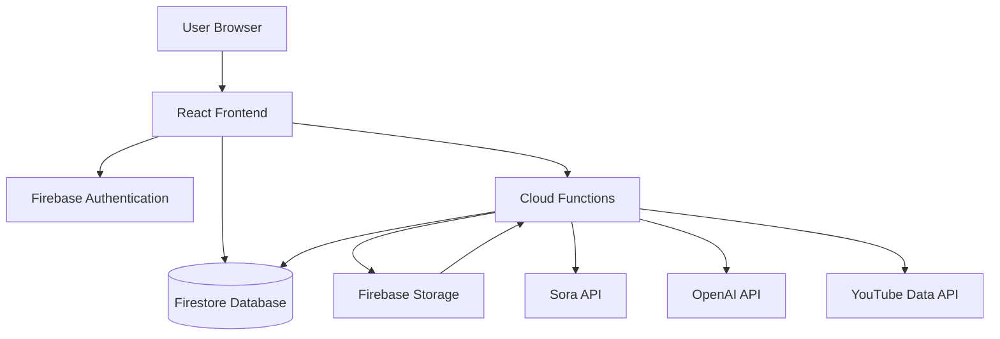

# Design Document

## Overview

Push2Tube is a web-based AI automation platform built on a React frontend with Firebase backend services. The architecture follows a serverless model where Cloud Functions orchestrate video generation via Sora, metadata generation via OpenAI, and YouTube uploads via the YouTube Data API. Real-time job status updates are delivered through Firestore listeners, providing users with immediate feedback on their video generation pipeline.

The system is designed for scalability and security, with all sensitive operations (API calls, token management) handled server-side. The frontend focuses on user experience with a responsive interface for prompt submission, job monitoring, and history viewing.

## Architecture

### High-Level Architecture



### Component Layers

1. **Presentation Layer**: React application with Vite build system
2. **Authentication Layer**: Firebase Authentication with Google OAuth
3. **Data Layer**: Firestore for real-time data synchronization
4. **Business Logic Layer**: Cloud Functions for serverless processing
5. **Storage Layer**: Firebase Storage for temporary video files
6. **Integration Layer**: External APIs (Sora, OpenAI, YouTube)

### Data Flow

1. User submits prompt through React UI
2. Frontend creates Video Job document in Firestore
3. Firestore trigger invokes Cloud Function
4. Cloud Function orchestrates:
   - Sora video generation
   - OpenAI metadata generation
   - Firebase Storage upload
   - YouTube video upload
5. Status updates written to Firestore
6. Frontend receives real-time updates via Firestore listeners

## Components and Interfaces

### Frontend Components

#### AuthenticationComponent
- **Responsibility**: Handle user login/logout
- **Interface**:
  - `signInWithGoogle()`: Initiates Google OAuth flow
  - `signOut()`: Logs out current user
  - `onAuthStateChanged(callback)`: Listens for auth state changes

#### YouTubeConnectionComponent
- **Responsibility**: Manage YouTube account linking
- **Interface**:
  - `connectYouTube()`: Initiates YouTube OAuth flow
  - `disconnectYouTube()`: Removes YouTube connection
  - `getConnectionStatus()`: Returns current connection state

#### PromptSubmissionComponent
- **Responsibility**: Accept and validate user prompts
- **Interface**:
  - `submitPrompt(prompt, privacyStatus)`: Creates new video job
  - `validatePrompt(prompt)`: Ensures prompt is valid
  - `setPrivacyPreference(status)`: Updates default privacy setting

#### JobMonitorComponent
- **Responsibility**: Display real-time job progress
- **Interface**:
  - `subscribeToJob(jobId)`: Listens for job status updates
  - `unsubscribeFromJob(jobId)`: Stops listening to job
  - `renderJobStatus(job)`: Displays current job state

#### JobHistoryComponent
- **Responsibility**: Show user's video generation history
- **Interface**:
  - `fetchUserJobs(userId)`: Retrieves all jobs for user
  - `renderJobList(jobs)`: Displays job history
  - `openYouTubeVideo(videoId)`: Opens published video

### Backend Components (Cloud Functions)

#### createVideoJob
- **Trigger**: HTTP request from frontend
- **Responsibility**: Validate request and create Firestore job document
- **Interface**:
  - Input: `{ userId, prompt, privacyStatus }`
  - Output: `{ jobId, status }`

#### processVideoJob
- **Trigger**: Firestore onCreate for Video Job documents
- **Responsibility**: Orchestrate entire video generation pipeline
- **Interface**:
  - Input: Firestore document snapshot
  - Output: Updates to Firestore document

#### generateVideo
- **Responsibility**: Call Sora API for video generation
- **Interface**:
  - Input: `{ prompt }`
  - Output: `{ videoUrl, duration }`

#### generateMetadata
- **Responsibility**: Call OpenAI API for title, description, tags
- **Interface**:
  - Input: `{ prompt }`
  - Output: `{ title, description, tags[] }`

#### uploadToYouTube
- **Responsibility**: Upload video to YouTube with metadata
- **Interface**:
  - Input: `{ videoUrl, metadata, oauthToken, privacyStatus }`
  - Output: `{ youtubeVideoId, publishedUrl }`

#### refreshYouTubeToken
- **Responsibility**: Refresh expired OAuth tokens
- **Interface**:
  - Input: `{ userId, refreshToken }`
  - Output: `{ newAccessToken, expiresAt }`

### External API Interfaces

#### Sora API
- **Endpoint**: OpenAI Sora video generation
- **Method**: POST to video generation endpoint
- **Request**: `{ prompt, duration, resolution }`
- **Response**: `{ videoUrl, status }`

#### OpenAI Text API
- **Endpoint**: OpenAI Chat Completions
- **Method**: POST to completions endpoint
- **Request**: System prompt + user prompt for metadata generation
- **Response**: Structured JSON with title, description, tags

#### YouTube Data API v3
- **Endpoint**: videos.insert
- **Method**: POST with multipart upload
- **Request**: Video file + metadata (title, description, tags, privacy)
- **Response**: `{ videoId, publishedAt, url }`

## Data Models

### User Document (Firestore)
```typescript
interface User {
  uid: string;                    // Firebase Auth UID
  email: string;                  // User email
  displayName: string;            // User display name
  youtubeConnected: boolean;      // YouTube connection status
  youtubeChannelId?: string;      // YouTube channel ID
  oauthRefreshToken?: string;     // Encrypted OAuth refresh token
  oauthAccessToken?: string;      // Current access token
  oauthExpiresAt?: number;        // Token expiration timestamp
  defaultPrivacyStatus: string;   // Default video privacy (public/unlisted/private)
  createdAt: Timestamp;           // Account creation time
  lastLoginAt: Timestamp;         // Last login time
}
```

### VideoJob Document (Firestore)
```typescript
interface VideoJob {
  jobId: string;                  // Unique job identifier
  userId: string;                 // Owner user ID
  prompt: string;                 // Original user prompt
  status: JobStatus;              // Current job status
  privacyStatus: string;          // Video privacy setting
  
  // Video generation
  videoUrl?: string;              // Firebase Storage URL
  videoDuration?: number;         // Video length in seconds
  
  // Metadata
  title?: string;                 // Generated title
  description?: string;           // Generated description
  tags?: string[];                // Generated tags
  
  // YouTube
  youtubeVideoId?: string;        // Published video ID
  youtubeUrl?: string;            // Published video URL
  
  // Timestamps
  createdAt: Timestamp;           // Job creation time
  startedAt?: Timestamp;          // Processing start time
  completedAt?: Timestamp;        // Job completion time
  
  // Error handling
  error?: string;                 // Error message if failed
  retryCount: number;             // Number of retry attempts
}

enum JobStatus {
  PENDING = 'pending',
  GENERATING_VIDEO = 'generating_video',
  GENERATING_METADATA = 'generating_metadata',
  UPLOADING_TO_YOUTUBE = 'uploading_to_youtube',
  COMPLETED = 'completed',
  FAILED = 'failed'
}
```

### Configuration (Environment Variables)
```typescript
interface Config {
  // Firebase
  FIREBASE_API_KEY: string;
  FIREBASE_PROJECT_ID: string;
  FIREBASE_STORAGE_BUCKET: string;
  
  // OpenAI
  OPENAI_API_KEY: string;
  SORA_API_ENDPOINT: string;
  
  // YouTube
  YOUTUBE_CLIENT_ID: string;
  YOUTUBE_CLIENT_SECRET: string;
  YOUTUBE_REDIRECT_URI: string;
  
  // Application
  MAX_RETRY_ATTEMPTS: number;
  VIDEO_STORAGE_EXPIRY_HOURS: number;
}
```

## Correctness Properties

*A property is a characteristic or behavior that should hold true across all valid executions of a system—essentially, a formal statement about what the system should do. Properties serve as the bridge between human-readable specifications and machine-verifiable correctness guarantees.*


### Core Workflow Properties

Property 1: Empty prompt rejection
*For any* string composed entirely of whitespace or empty, submitting it as a prompt should be rejected and no Video Job should be created
**Validates: Requirements 3.1**

Property 2: Valid prompt creates job
*For any* valid (non-empty) prompt, submitting it should result in a new Video Job record being created in Firestore with status set to pending
**Validates: Requirements 3.2, 6.1**

Property 3: Job creation triggers processing
*For any* newly created Video Job, the Cloud Function should be invoked to begin processing
**Validates: Requirements 3.3**

Property 4: Video generation stores file
*For any* Video Job where Sora successfully generates a video, the video file should be stored in Firebase Storage and the job should contain a valid storage URL
**Validates: Requirements 3.5**

Property 5: Complete metadata generation
*For any* prompt sent to OpenAI for metadata generation, the response should contain a non-empty title, non-empty description, and at least one tag
**Validates: Requirements 4.2, 4.3, 4.4**

Property 6: Metadata persistence
*For any* Video Job where metadata generation completes, the job record should be updated with the generated title, description, and tags
**Validates: Requirements 4.5**

Property 7: Status progression
*For any* Video Job that progresses through the pipeline, the status should transition in order: pending → generating_video → generating_metadata → uploading_to_youtube → completed
**Validates: Requirements 6.2, 6.3, 6.4**

Property 8: YouTube upload includes metadata
*For any* video uploaded to YouTube, the upload request should include the generated title, description, and tags
**Validates: Requirements 5.3**

Property 9: Privacy status application
*For any* Video Job with a specified privacy status, the YouTube upload should apply that exact privacy setting
**Validates: Requirements 5.4, 10.3**

Property 10: Successful upload completion
*For any* Video Job where YouTube upload succeeds, the job status should be updated to completed and the job should contain a valid YouTube video ID
**Validates: Requirements 5.5**

### Authentication and Security Properties

Property 11: Successful authentication creates user record
*For any* successful Firebase authentication, a user record should exist in Firestore with the authenticated user's UID
**Validates: Requirements 1.3**

Property 12: OAuth success stores refresh token
*For any* successful YouTube OAuth authorization, the user's Firestore record should contain an encrypted refresh token
**Validates: Requirements 2.2**

Property 13: Token refresh on expiration
*For any* OAuth access token that has expired, the system should attempt to refresh it using the stored refresh token before making YouTube API calls
**Validates: Requirements 2.4**

Property 14: Authenticated Cloud Function calls
*For any* frontend request to a Cloud Function, the request should include a valid Firebase ID token
**Validates: Requirements 9.1**

Property 15: Cloud Function token verification
*For any* Cloud Function execution, the function should verify the Firebase ID token and reject requests with invalid or missing tokens
**Validates: Requirements 9.2**

Property 16: Token encryption
*For any* OAuth token stored in Firestore, the token should be encrypted before storage
**Validates: Requirements 9.4**

Property 17: User data isolation
*For any* user accessing Firestore, the security rules should prevent access to other users' Video Job records
**Validates: Requirements 9.5**

### Error Handling Properties

Property 18: Retry logic for metadata generation
*For any* OpenAI metadata generation failure, the system should retry up to three times before marking the job as failed
**Validates: Requirements 8.2**

Property 19: Error logging and status update
*For any* Cloud Function error, the error details should be logged and the associated Video Job status should be updated to failed with an error message
**Validates: Requirements 8.5**

### User Interface Properties

Property 20: Real-time status updates
*For any* Video Job status change in Firestore, the frontend should reflect the updated status within 2 seconds via Firestore listeners
**Validates: Requirements 6.5**

Property 21: User job retrieval
*For any* user accessing the dashboard, only that user's Video Job records should be retrieved from Firestore
**Validates: Requirements 7.1**

Property 22: Job history ordering
*For any* list of Video Jobs displayed, the jobs should be ordered by creation timestamp with the newest job first
**Validates: Requirements 7.4**

Property 23: Default privacy setting
*For any* Video Job created without an explicit privacy status, the privacy status should default to unlisted
**Validates: Requirements 10.2**

Property 24: Privacy preference persistence
*For any* user who updates their default privacy preference, the new preference should be stored in their Firestore user record
**Validates: Requirements 10.4**

Property 25: Privacy preference pre-population
*For any* new Video Job creation, the privacy setting should be pre-populated with the user's stored default preference
**Validates: Requirements 10.5**

## Error Handling

### Error Categories

1. **Authentication Errors**
   - Invalid credentials
   - Expired sessions
   - OAuth authorization failures
   - Token refresh failures

2. **Validation Errors**
   - Empty or invalid prompts
   - Missing required fields
   - Invalid privacy status values

3. **API Errors**
   - Sora generation failures
   - OpenAI API failures
   - YouTube API failures (quota, permissions, network)
   - Firebase service errors

4. **System Errors**
   - Cloud Function timeouts
   - Storage failures
   - Database write failures

### Error Handling Strategies

#### Retry Logic
- OpenAI metadata generation: 3 retries with exponential backoff
- YouTube token refresh: 2 retries
- Firestore writes: Automatic retry via Firebase SDK
- No retries for Sora (expensive operation)

#### User Notification
- All errors should update Video Job status to "failed"
- Error messages should be user-friendly and actionable
- Critical errors (auth failures) should show modal dialogs
- Non-critical errors should show toast notifications

#### Error Recovery
- OAuth failures: Prompt user to reconnect YouTube account
- Quota errors: Display clear message about YouTube API limits
- Generation failures: Allow user to retry with modified prompt
- System errors: Log for debugging, show generic error to user

#### Logging
- All Cloud Function errors logged to Firebase Console
- Include: timestamp, user ID, job ID, error type, stack trace
- Sensitive data (tokens, API keys) excluded from logs

### Error Response Format
```typescript
interface ErrorResponse {
  code: string;              // Error code (e.g., "SORA_GENERATION_FAILED")
  message: string;           // User-friendly error message
  details?: string;          // Technical details (optional)
  retryable: boolean;        // Whether user can retry
  timestamp: number;         // Error occurrence time
}
```

## Testing Strategy

Push2Tube requires a comprehensive testing approach that combines unit tests for specific functionality and property-based tests for universal correctness guarantees.

### Unit Testing

Unit tests will verify specific examples, integration points, and edge cases:

**Frontend Unit Tests (Vitest + React Testing Library)**
- Component rendering with different props
- User interaction handlers (button clicks, form submissions)
- Firestore listener setup and cleanup
- Authentication state changes
- Error boundary behavior

**Backend Unit Tests (Jest)**
- Cloud Function input validation
- API response parsing
- Token encryption/decryption
- Error message formatting
- Firestore security rules

**Integration Tests**
- End-to-end authentication flow
- Video Job creation and status updates
- OAuth token refresh cycle
- File upload to Firebase Storage

### Property-Based Testing

Property-based tests will verify universal properties across all inputs using **fast-check** for JavaScript/TypeScript.

**Configuration:**
- Each property test MUST run a minimum of 100 iterations
- Each test MUST be tagged with: `**Feature: push2tube-platform, Property {number}: {property_text}**`
- Each correctness property MUST be implemented by a SINGLE property-based test

**Property Test Coverage:**
- Input validation (empty prompts, whitespace, special characters)
- Status transitions (all valid state progressions)
- Data persistence (job creation, metadata storage)
- Security (token verification, data isolation)
- Error handling (retry logic, error propagation)

**Example Property Test Structure:**
```typescript
// **Feature: push2tube-platform, Property 1: Empty prompt rejection**
test('empty or whitespace prompts are rejected', () => {
  fc.assert(
    fc.property(
      fc.string().filter(s => s.trim() === ''),
      async (emptyPrompt) => {
        const result = await submitPrompt(emptyPrompt);
        expect(result.success).toBe(false);
        expect(result.error).toBeDefined();
      }
    ),
    { numRuns: 100 }
  );
});
```

### Test Environment

- **Frontend**: Vitest with React Testing Library
- **Backend**: Jest with Firebase emulators
- **Property Testing**: fast-check library
- **E2E**: Playwright for critical user flows
- **Mocking**: Mock Sora, OpenAI, and YouTube APIs in tests

### Testing Priorities

1. **Critical Path**: Authentication → Job Creation → Status Updates → Upload
2. **Security**: Token handling, data isolation, input validation
3. **Error Handling**: All failure scenarios and retry logic
4. **Real-time Updates**: Firestore listener behavior
5. **Edge Cases**: Empty inputs, expired tokens, API failures

## Performance Considerations

### Frontend Optimization
- Lazy load components for faster initial render
- Implement virtual scrolling for job history (if >100 jobs)
- Debounce prompt input validation
- Cache user preferences in localStorage
- Use React.memo for expensive components

### Backend Optimization
- Parallel execution: Generate video and metadata simultaneously
- Connection pooling for external API calls
- Firestore indexes for efficient job queries
- Cloud Function cold start mitigation (keep-alive pings)
- Video file cleanup: Delete from Storage after YouTube upload

### Scalability
- Firestore automatically scales with usage
- Cloud Functions scale horizontally
- Rate limiting on job creation (max 10 jobs per user per hour)
- Queue system for high-volume processing (future enhancement)

### Cost Optimization
- Delete temporary video files after successful upload
- Use Firestore TTL for old job records (>90 days)
- Implement caching for repeated metadata requests
- Monitor API usage to stay within free tiers

## Security Considerations

### Authentication
- Firebase Authentication handles session management
- ID tokens expire after 1 hour, automatically refreshed
- Secure HTTP-only cookies for session persistence

### Authorization
- Firestore security rules enforce user data isolation
- Cloud Functions verify ID tokens on every request
- YouTube OAuth scopes limited to upload-only permissions

### Data Protection
- OAuth tokens encrypted at rest using Firebase encryption
- API keys stored in Cloud Functions environment variables
- No sensitive data in frontend code or logs
- HTTPS enforced for all communications

### API Key Management
- Separate keys for development and production
- Keys rotated quarterly
- Access restricted via Firebase project permissions
- YouTube API key restricted to specific domains

## Deployment Strategy

### Development Environment
- Local Firebase emulators for Firestore, Auth, Functions
- Mock APIs for Sora, OpenAI, YouTube
- Hot reload for frontend (Vite)
- Local testing with test Google account

### Staging Environment
- Firebase project: push2tube-staging
- Real Firebase services, mock external APIs
- Test OAuth flow with staging credentials
- Performance testing with realistic data

### Production Environment
- Firebase project: push2tube-production
- All services live with production credentials
- Monitoring via Firebase Console
- Error tracking with Firebase Crashlytics

### CI/CD Pipeline
1. Run unit tests and property tests
2. Build frontend with Vite
3. Deploy Cloud Functions
4. Deploy Firestore security rules
5. Deploy frontend to Firebase Hosting
6. Run smoke tests on deployed environment

### Monitoring
- Firebase Performance Monitoring for frontend
- Cloud Functions logs and metrics
- Custom metrics: job success rate, average processing time
- Alerts for error rate spikes or API quota limits

## Future Enhancements

- Batch video generation (multiple prompts at once)
- Video editing capabilities (trim, add music)
- Scheduled publishing
- Analytics dashboard (views, engagement)
- Support for other platforms (TikTok, Instagram)
- Custom branding (watermarks, intros/outros)
- Team collaboration features
- Video templates and presets
